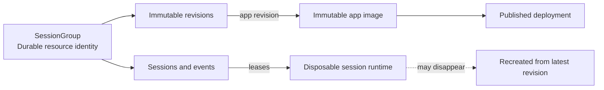

# Trace AWS Production Deployment Blueprint

Status: proposed production architecture and implementation plan  
Audience: Trace engineering and infrastructure owners  
Scope: the Trace control plane, isolated cloud sessions, Trace-managed app source, artifact storage, and always-on generated app deployments on AWS

## 1. Executive decision

Build Trace on AWS around four independent lifecycles:

1. A highly available **Trace control plane** serves the web application, GraphQL, events, authentication, managed Git, and runtime orchestration.
2. Every active cloud session receives one **disposable, isolated ECS Fargate task** running the existing container bridge.
3. Every app, design, or future document is represented by its existing `SessionGroup`; durable revisions live outside the session runtime.
4. A published app is an independent **deployment** built from an immutable app revision. Stopping its development session does not stop the published app.

Use these systems of record:

| Data | System of record |
| --- | --- |
| Coding project source | GitHub |
| Trace app source | Trace-managed bare Git repository |
| Designs, PDFs, Office documents, spreadsheets, and media | Immutable objects in Amazon S3 |
| Trace entities, events, revision metadata, and desired state | Aurora PostgreSQL |
| Transient pub/sub, distributed locks, runtime routing, and worker queues | ElastiCache for Valkey/Redis OSS plus SQS where durability is required |
| Built Trace and generated-app images | Amazon ECR |
| Running development environments | Disposable Fargate tasks |
| Running published apps | Replaceable Fargate tasks with external durable data |

The runtime filesystem is never authoritative. A runtime may disappear without warning; completed agent operations must already be recoverable from Git or S3.

## 2. Confirmed product assumptions

This plan uses the following product decisions:

- One app or design maps one-to-one to a `SessionGroup`.
- A session works on one group; concurrent editing of one group is not required.
- Coding repositories use GitHub as their source of truth.
- Users can create Trace apps without connecting GitHub, so Trace must retain an internal Git capability for app source.
- Designs need compute while an agent is editing or rendering them. The existing `cleanupIdleCloudSessionGroups` job deprovisions their inactive cloud runtimes using the configured cloud-session-group idle threshold; no design-specific cleanup mechanism is needed.
- Published apps must be always available and may need persistent PostgreSQL data.
- Every completed agent operation creates a durable revision.
- Deleting a group is destructive in the initial product: it permanently deletes the group's source, artifacts, deployment, and app data. A user-recoverable trash or retention window may be added later.
- Future content types include PDFs, documents, presentations, spreadsheets, images, audio, video, and other media.
- The target is thousands of concurrent users and potentially thousands of active runtime tasks.

## 3. Core domain boundaries

Do not make sessions, resources, runtimes, and deployments synonyms.



### 3.1 Session group

The existing `SessionGroup` is the durable identity for one coding project context, app, design, or document. It owns:

- Sessions and event history.
- Its repository or artifact revisions.
- The current revision pointer.
- An optional published deployment.
- Its archive and destructive deletion lifecycle.

Avoid adding a second generic `Resource` entity until a real product requirement needs resources outside session groups.

### 3.2 Session

A session is an interaction and event scope. It does not own a permanent computer. A session may bind to a runtime, lose it, and later bind to a newly provisioned runtime restored from the latest durable revision.

### 3.3 Runtime

A runtime is a lease on isolated compute. It has:

- A stable Trace runtime instance ID.
- A provider runtime ID, which is the ECS task ARN.
- A short-lived, session-bound bridge credential.
- A lifecycle state and timestamps.
- No irreplaceable state.

### 3.4 Revision

A completed agent operation produces an immutable revision:

- Coding and app groups use a pushed Git commit.
- Artifact groups use an S3 object plus checksum and metadata.
- The revision record links the operation's prompt event, actor, parent revision, and storage locator.
- Trace acknowledges the operation as durable only after the Git push or S3 upload succeeds and the service-layer transaction records the revision and event.

### 3.5 Deployment

A deployment is durable desired state, not a development runtime. It points to an immutable app source revision and image digest and declares whether the app should be running.

## 4. Target AWS topology

Deploy one production Region first, across three Availability Zones. Use a separate AWS account for production and, preferably, separate accounts for development and staging under AWS Organizations.

```text
Internet
  |
Route 53 + ACM + AWS WAF
  |
Public Application Load Balancer
  |-- trace.example.com ----------------> web ECS service
  |-- API/GraphQL/Git paths ------------> API ECS service
  |-- /bridge and runtime traffic ------> runtime gateway ECS service
  |-- *.preview.trace.example.com ------> preview router/runtime gateway
  `-- *.apps.trace.example.com ---------> published app gateway

Private application subnets, 3 AZs
  |-- Trace API and web tasks
  |-- runtime gateway tasks
  |-- launcher/lifecycle workers
  |-- artifact workers
  `-- generated-app gateways

Private runtime subnets, 3 AZs
  |-- one Fargate task per active session
  `-- published app Fargate tasks

Isolated data subnets, 3 AZs
  |-- Aurora PostgreSQL control-plane cluster
  |-- separate Aurora PostgreSQL app-data cluster/pool
  |-- RDS Proxy
  |-- ElastiCache replication group
  `-- EFS mount targets

Regional services
  |-- S3 artifact and log buckets
  |-- ECR repositories
  |-- SQS queues and DLQs
  |-- EventBridge rules
  |-- Secrets Manager and KMS
  |-- CloudWatch and CloudTrail
  `-- AWS Backup
```

## 5. AWS account and infrastructure-as-code foundation

### 5.1 Accounts

Create at minimum:

- `trace-production`
- `trace-staging`
- `trace-development`
- Optional `trace-log-archive` and `trace-security` accounts as the organization grows.

Enable:

- AWS Organizations with service control policies.
- IAM Identity Center for human access.
- MFA for all human access and the root account.
- Organization CloudTrail delivered to a protected log account or log bucket.
- AWS Config and Security Hub in production.
- GuardDuty in every enabled Region.
- AWS Budgets and Cost Anomaly Detection.

No engineer should deploy production with long-lived IAM user keys.

### 5.2 Infrastructure as code

Create a TypeScript AWS CDK application under `infra/` because Trace is already a TypeScript monorepo. Terraform is also acceptable, but select one system and make it authoritative.

Recommended stacks:

| Stack | Responsibility |
| --- | --- |
| `TraceFoundationStack` | VPC, subnets, endpoints, DNS, certificates, KMS, base security groups |
| `TraceDataStack` | Aurora, RDS Proxy, ElastiCache, EFS, S3, AWS Backup |
| `TraceControlPlaneStack` | ALB, WAF, ECS cluster, API/web/gateway services, autoscaling |
| `TraceRuntimeStack` | Runtime cluster, task definitions, launcher API/Lambda, queues, EventBridge |
| `TraceAppDeploymentStack` | Build system, app image repository, app gateway, deployment workers |
| `TraceObservabilityStack` | Logs, metrics, alarms, dashboards, SNS/PagerDuty destinations |

Every resource must carry `Application=trace`, `Environment`, `Owner`, and `CostCenter` tags.

## 6. Networking

### 6.1 VPC layout

Create a `/16` VPC with DNS hostnames and DNS resolution enabled. Reserve enough private IP space for one ENI per Fargate task; every Fargate task receives its own ENI. AWS documents this behavior in [Fargate task networking](https://docs.aws.amazon.com/AmazonECS/latest/developerguide/fargate-task-networking.html).

Example subnet plan:

| Tier | AZ A | AZ B | AZ C | Purpose |
| --- | --- | --- | --- | --- |
| Public | `/24` | `/24` | `/24` | ALB and NAT gateways only |
| Control plane | `/21` | `/21` | `/21` | API, web, gateway, and workers |
| Session runtime | `/19` | `/19` | `/19` | Thousands of session/app task ENIs |
| Data | `/24` | `/24` | `/24` | Aurora, ElastiCache, and EFS mounts |

Do not assign public IPs to ECS tasks.

### 6.2 Internet egress

Create one NAT Gateway per AZ for production and route each private subnet to the NAT Gateway in the same AZ. Session tasks require outbound access to GitHub, model providers, package registries, and arbitrary development dependencies. NAT permits outbound connections without accepting unsolicited inbound traffic. See [AWS NAT devices](https://docs.aws.amazon.com/vpc/latest/userguide/vpc-nat.html).

Add VPC endpoints to reduce NAT cost and keep AWS traffic private:

- S3 gateway endpoint.
- ECR API and ECR Docker interface endpoints.
- CloudWatch Logs interface endpoint.
- Secrets Manager interface endpoint.
- KMS interface endpoint.
- SQS interface endpoint.
- Optional STS and ECS endpoints.

ECR image layers also require S3 connectivity; AWS documents the endpoint combination in [ECR VPC endpoints](https://docs.aws.amazon.com/AmazonECR/latest/userguide/vpc-endpoints.html).

### 6.3 Security groups

Create narrowly scoped security groups:

| Security group | Inbound | Outbound |
| --- | --- | --- |
| `trace-public-alb` | TCP 443 from internet; TCP 80 only for redirect | API/web/gateway target ports |
| `trace-web` | Port 3000 from ALB | CloudWatch/VPC endpoints only |
| `trace-api` | Port 4000 from ALB and internal workers | Aurora proxy, Redis, EFS, AWS endpoints, HTTPS internet as required |
| `trace-runtime-gateway` | Gateway port from ALB/internal routers | Redis, Aurora, AWS endpoints |
| `trace-session-runtime` | No inbound rules | HTTPS internet, Trace public bridge, managed Git HTTPS; no data-subnet access |
| `trace-app-runtime` | No inbound rules when using the outbound app tunnel | App-data DB proxy, app storage broker, gateway |
| `trace-aurora` | PostgreSQL from API/RDS Proxy only | Default return traffic |
| `trace-app-aurora` | PostgreSQL from app tasks/proxy only | Default return traffic |
| `trace-redis` | Redis TLS port from API/gateway/workers | Default return traffic |
| `trace-efs` | NFS from API Git-storage tasks only | Default return traffic |

Untrusted session tasks must never be able to connect directly to the Trace control-plane database, Redis, EFS, or Secrets Manager.

Security groups cannot restrict egress by hostname. If strong outbound policy is required, add an authenticated egress proxy or AWS Network Firewall and explicitly define the supported package/model-provider behavior.

## 7. DNS, TLS, ingress, and WebSockets

### 7.1 DNS names

Create Route 53 records for:

- `trace.example.com` — main product origin.
- `*.preview.trace.example.com` — private development app previews.
- `*.apps.trace.example.com` — published generated apps.
- Optional `api.trace.example.com` if the API is later separated from the web origin.

Create ACM certificates for the main origin and both wildcard subdomains. A wildcard for `*.trace.example.com` does not cover `*.preview.trace.example.com`.

Set:

```text
TRACE_WEB_URL=https://trace.example.com
TRACE_SERVER_PUBLIC_URL=https://trace.example.com
TRACE_CLOUD_BRIDGE_URL=wss://trace.example.com/bridge
TRACE_ENDPOINT_PREVIEW_BASE_HOST=preview.trace.example.com
TRACE_ENDPOINT_PREVIEW_PUBLIC_SCHEME=https
CORS_ALLOWED_ORIGINS=https://trace.example.com
TRACE_AUTH_COOKIE_SAME_SITE=lax
```

### 7.2 ALB routing

Use an internet-facing Application Load Balancer with HTTPS termination and host-header preservation. Route:

| Match | Target |
| --- | --- |
| Host `trace.example.com`, default | Web target group |
| Paths `/auth*`, `/graphql*`, `/uploads*`, `/webhooks/github*`, `/slack*`, `/ws*`, `/git*`, `/health`, `/.well-known/*`, `/apple-app-site-association` | API target group |
| Paths `/bridge*`, `/terminal*` | Runtime gateway target group after the gateway split |
| Host `*.preview.trace.example.com` | Preview router/gateway target group |
| Host `*.apps.trace.example.com` | Published app gateway target group |

The existing self-hosted Caddy configuration does not route `/git`; the AWS routing rules must include it for managed repositories to work.

Application Load Balancers natively support WebSockets. Set the ALB idle timeout to a value compatible with Trace bridge and subscription heartbeats, such as 300–900 seconds, and keep application heartbeats comfortably below it. The default ALB idle timeout is 60 seconds and may be changed up to 4,000 seconds. See [ALB WebSocket support](https://docs.aws.amazon.com/elasticloadbalancing/latest/application/load-balancer-listeners.html) and [ALB connection timeout settings](https://docs.aws.amazon.com/elasticloadbalancing/latest/application/edit-load-balancer-attributes.html).

Enable:

- ALB deletion protection.
- ALB access logs to the log bucket.
- Desync mitigation in defensive or strictest mode after compatibility testing.
- AWS WAF managed baseline rules.
- Separate rate-based rules for authentication, GraphQL mutations, uploads, Git receive-pack, and public app traffic. AWS WAF rate rules can aggregate and limit high request rates; see [rate-based rules](https://docs.aws.amazon.com/waf/latest/developerguide/waf-rule-statement-type-rate-based.html).

Do not apply response caching to GraphQL, WebSockets, Git smart HTTP, authenticated previews, or app tunnels.

## 8. Container images and ECR

Create ECR repositories:

- `trace/control-plane`
- `trace/session-runtime`
- `trace/generated-app-base`
- `trace/generated-apps`
- Optional `trace/artifact-workers`

Configure:

- Immutable tags for production release tags.
- Deployment by image digest, not `latest`.
- ECR enhanced image scanning.
- Lifecycle rules retaining recent releases and referenced app images.
- Cross-Region replication when the disaster-recovery Region is introduced.

The repository already builds:

- The combined web/backend production image from the root `Dockerfile`.
- The agent runtime from `apps/container-bridge/Dockerfile`.

Build and test `linux/amd64` first because the runtime contains native `node-pty` binaries, Chromium, PostgreSQL, and multiple coding CLIs. Add ARM only after the full runtime test suite and smoke test pass on ARM.

## 9. Trace control-plane data services

### 9.1 Aurora PostgreSQL

Create an Aurora PostgreSQL cluster named `trace-control-plane`:

- One writer and at least one reader in different AZs.
- Private DB subnet group spanning three AZs.
- Encryption with a customer-managed KMS key.
- Deletion protection enabled.
- Automated backups and point-in-time recovery with a 35-day retention target.
- Performance Insights/Database Insights and Enhanced Monitoring enabled.
- TLS required for clients.
- A separate migration role and application role.
- An RDS Proxy endpoint for the application role.

Aurora stores copies of cluster data across three Availability Zones; see [Aurora storage reliability](https://docs.aws.amazon.com/AmazonRDS/latest/AuroraUserGuide/Aurora.Overview.StorageReliability.html). RDS Proxy pools and reuses connections and improves resilience during database failover; see [Amazon RDS Proxy](https://docs.aws.amazon.com/AmazonRDS/latest/UserGuide/rds-proxy.html).

Before the first deployment:

1. Choose an Aurora PostgreSQL engine version that supports the `vector` extension.
2. Confirm the privileged migration role can execute `CREATE EXTENSION vector` and `DROP EXTENSION vector` because Trace's historical migration chain creates and later removes pgvector.
3. Run `prisma migrate deploy` once from a dedicated migration task.
4. Do not run migrations concurrently from every API task.

Required code/container change: add a `ROLE=migrate` entrypoint and remove automatic migration execution from normal `ROLE=backend` startup.

### 9.2 ElastiCache

Create one ElastiCache Valkey or Redis OSS replication group initially:

- Cluster mode disabled for compatibility with the current single `REDIS_URL` and `ioredis` usage.
- One primary and at least one replica in another AZ.
- Multi-AZ automatic failover enabled.
- Encryption at rest and TLS in transit.
- Authentication token or IAM authentication where supported by the selected engine/client combination.
- Automatic backups if Redis Streams are used for recoverable work; PostgreSQL/SQS must remain authoritative.

Multi-AZ requires a replica in another AZ and promotes a replica on primary failure; see [ElastiCache Multi-AZ](https://docs.aws.amazon.com/AmazonElastiCache/latest/dg/AutoFailover.html).

Use Redis for:

- GraphQL event pub/sub.
- Distributed cleanup locks.
- Runtime-to-gateway routing with TTLs.
- Presence and heartbeats.
- Short-lived command routing.

Do not make Redis the only store for session lifecycle state, deployments, artifacts, or user-visible events.

### 9.3 S3 artifact storage

Create separate buckets:

- `trace-artifacts-<account>-<region>` — uploads, artifact revisions, previews, captures, and exports.
- `trace-alb-logs-<account>-<region>` — ALB logs.
- `trace-audit-logs-<account>-<region>` — CloudTrail and security logs if a log-archive account is not yet used.
- Optional `trace-build-sources-<account>-<region>` — generated-app build inputs.

For the artifact bucket:

- Enable all S3 Block Public Access settings. AWS recommends enabling all four settings at account and bucket level; see [S3 Block Public Access](https://docs.aws.amazon.com/AmazonS3/latest/userguide/access-control-block-public-access.html).
- Enable versioning.
- Use SSE-KMS with a customer-managed key.
- Require TLS in the bucket policy.
- Disable ACLs with bucket-owner-enforced ownership.
- Permit access only through the API/artifact-worker roles and presigned requests.
- Configure CORS only for the exact Trace web origin and required HTTP methods.
- Add lifecycle rules for incomplete multipart uploads, old transient captures, and archived revisions.
- Use unique immutable object keys rather than overwriting a key.

Suggested object layout:

```text
orgs/<org-id>/groups/<group-id>/revisions/<revision-id>/<filename>
orgs/<org-id>/groups/<group-id>/previews/<revision-id>/<filename>
orgs/<org-id>/apps/<group-id>/uploads/<object-id>/<filename>
orgs/<org-id>/app-checkpoints/<checkpoint-id>/<capture>
```

S3 encrypts new objects by default and Versioning can preserve older versions, but application-level immutable revision IDs remain the source of truth. See [S3 access and data protection controls](https://docs.aws.amazon.com/AmazonS3/latest/userguide/access-management.html).

Do not enable S3 Object Lock by default because product deletion is required. Add Governance mode later only if audit/compliance requirements justify protected retention.

### 9.4 Managed Git storage on EFS

The current `GitStorageAdapter` requires POSIX filesystem paths for bare repositories. For a horizontally scaled API service, use a Regional EFS filesystem rather than task-local disk or one task-attached EBS volume.

Create:

- Regional EFS with General Purpose performance and Elastic throughput.
- Encryption at rest with a customer-managed KMS key.
- Mount targets in each data subnet.
- An EFS access point rooted at `/trace-git` with the API container's UID/GID.
- TLS in transit and IAM authorization.
- An ECS volume mounted at `GIT_STORAGE_ROOT=/mnt/trace-git` on API tasks.
- Lifecycle transition for cold repository data after measurement.
- AWS Backup policies and restore tests.

EFS provides POSIX semantics, strong consistency, and file locking and is available to ECS/Fargate; see [What is Amazon EFS](https://docs.aws.amazon.com/efs/latest/ug/whatisefs.html). ECS requires transit encryption when using EFS IAM authorization; see [ECS EFS configuration](https://docs.aws.amazon.com/AmazonECS/latest/developerguide/specify-efs-config.html).

Application constraints:

- Enforce the one-active-writer rule per app group.
- Continue using Git's own ref locks and atomic updates.
- Run `git gc --auto` through a scheduled worker with a per-repository distributed lock.
- Monitor EFS metadata latency, Git push latency, IOPS, and throughput.
- Never mount EFS into untrusted session tasks. They clone and push through Trace's authenticated Git smart-HTTP route.

Why EFS instead of EBS here:

- A single API task plus EBS is the simplest prototype.
- A production API needs multiple tasks in multiple AZs, and ordinary EBS is a single-AZ block device.
- EFS lets every API task see the same repository tree without making one backend instance a single point of failure.

If EFS small-file latency becomes a bottleneck, extract managed Git into a dedicated service and shard repositories across stateful Git nodes. Do not optimize for that before measuring. AWS recommends General Purpose plus Elastic throughput for unpredictable EFS workloads; see [EFS performance](https://docs.aws.amazon.com/efs/latest/ug/performance.html).

## 10. ECS control-plane services

Create an ECS cluster `trace-control-plane` using Fargate and Fargate Spot capacity providers. Use On-Demand Fargate for API and gateways; use Spot only for interruptible background work.

### 10.1 Web service

Create `trace-web`:

- `ROLE=web`
- Port 3000.
- Minimum two tasks across AZs.
- ALB health check on `/`.
- Autoscale on CPU and ALB request count.
- No database, Redis, EFS, or Secrets Manager permissions.

Serving the built Vite application from S3/CloudFront is a valid later optimization, but ECS reuses the existing image and entrypoint with fewer moving pieces for the first production deployment.

### 10.2 API service

Create `trace-api`:

- `ROLE=backend` after migration startup is separated.
- Port 4000.
- Minimum three tasks, one per AZ, after distributed runtime routing is complete.
- Health check `/health`; add a distinct `/ready` endpoint that verifies required dependencies without turning transient dependency slowness into a restart storm.
- Mount the managed-Git EFS access point.
- Connect to Aurora through RDS Proxy and ElastiCache through TLS.
- Autoscale on CPU, memory, ALB request count, GraphQL latency, and event-loop lag.

### 10.3 Runtime gateway service

Create `trace-runtime-gateway` after extracting the in-memory runtime connection ownership from the general API process:

- Accept `/bridge` and terminal WebSocket upgrades.
- Own the live runtime socket and endpoint-tunnel state.
- Register `runtime-id -> gateway-id/internal-address` in Redis with heartbeat TTL.
- Receive commands through a gateway-addressed Redis Stream or equivalent broker.
- Acknowledge command delivery and return structured failures.
- Publish runtime output through the existing service layer/event service.
- Drain gracefully during deployments so runtimes reconnect before the task exits.
- Scale on active connections, messages per second, bytes proxied, CPU, memory, and event-loop lag.

This is a required scaling change. Today, `sessionRouter` and `EndpointProxyService` keep runtime and proxy maps in process memory. Simply raising the API ECS desired count would route commands or preview traffic to instances that do not own the socket.

The routing design should be:

```text
API or preview router
  -> lookup runtime owner in Redis
  -> send/forward to owning gateway
  -> gateway writes to runtime WebSocket
  -> runtime response returns through the same gateway
```

Use an internal authenticated HTTP/2 or WebSocket connection between routers and gateways for preview HTTP/WebSocket traffic; do not serialize large proxied bodies through Redis.

### 10.4 Background workers

Run background concerns as explicit ECS services or scheduled tasks rather than timers duplicated in every API process:

- The existing cloud-session idle cleanup (`cleanupIdleCloudSessionGroups`), moved intact into the worker role when singleton jobs are extracted from the API process.
- Stuck deprovision reconciliation.
- Endpoint traffic cleanup.
- Git garbage collection.
- Artifact preview/render/scan jobs.
- Group deletion and cascading resource cleanup.
- Deployment reconciliation.

Existing Redis locks prevent some duplicate work, but dedicated worker roles make ownership, scaling, and observability clearer.

## 11. Runtime launcher API

Trace already supports provisioned Agent Environments with `startUrl`, `stopUrl`, and `statusUrl`. Keep that contract.

### 11.1 AWS resources

Create:

- API Gateway HTTP API `trace-runtime-launcher` or a small HTTPS ECS launcher service.
- Lambda functions or routes for start, stop, and status.
- A launcher bearer secret in Secrets Manager, unless the Trace adapter is extended to sign requests with IAM/SigV4.
- A launcher execution role with narrowly scoped ECS and `iam:PassRole` permissions.
- CloudWatch log group with redaction and retention.
- AWS WAF/rate limits if the launcher endpoint is public.
- EventBridge ECS task-state rule delivered to an SQS lifecycle queue and DLQ.

The existing reference contract is documented in `examples/launchers/aws-ecs/README.md`.

Create the production Agent Environment with launcher-owned infrastructure metadata rather than user-supplied values. A representative configuration is:

```json
{
  "startUrl": "https://launcher.trace.example.com/trace/start-session",
  "stopUrl": "https://launcher.trace.example.com/trace/stop-session",
  "statusUrl": "https://launcher.trace.example.com/trace/session-status",
  "auth": {
    "type": "bearer",
    "secretId": "<Trace secret record containing the launcher token>"
  },
  "startupTimeoutSeconds": 180,
  "deprovisionPolicy": "on_session_end",
  "launcherMetadata": {
    "environment": "production",
    "profile": "trace-runtime-standard"
  }
}
```

The launcher resolves `profile` to fixed cluster, task-definition, subnet, security-group, and IAM-role allowlists. Do not place raw infrastructure override authority in organization-editable metadata.

### 11.2 Start

`POST /trace/start-session` must:

1. Authenticate the caller.
2. Validate the request and allowlisted task profile.
3. Derive an ECS `clientToken` from `Trace-Idempotency-Key`.
4. Call `RunTask` with count 1 in a runtime subnet and `assignPublicIp=DISABLED`.
5. Inject only the required bootstrap environment.
6. Tag the task with environment, organization, session, runtime instance, group, tool, and cost-allocation identifiers.
7. Return the ECS task ARN as `runtimeId` and `provisioning` status.

Never accept arbitrary cluster ARN, task definition ARN, IAM role ARN, subnet, security group, image, or command overrides from the request. Select them from launcher-owned allowlists.

### 11.3 Stop

`POST /trace/stop-session` must:

- Be idempotent.
- Verify the task belongs to Trace and the expected runtime/session.
- Call `StopTask` with an auditable reason.
- Return success when the task is already stopped or gone.
- Never wait synchronously for full task termination.

Trace must checkpoint before requesting a graceful stop, but forced task loss must still recover to the last completed operation.

### 11.4 Status

`POST /trace/session-status` calls `DescribeTasks` and maps ECS state to Trace state. ECS `RUNNING` means the infrastructure is running; the runtime is ready only when the authenticated bridge connects.

Use EventBridge state-change events for asynchronous reconciliation and status polling as a fallback. ECS sends task-state events directly to EventBridge with durable delivery, and duplicate events can be deduplicated by task/version information. See [ECS EventBridge events](https://docs.aws.amazon.com/eventbridge/latest/ref/events-ref-ecs.html) and [ECS event versions](https://docs.aws.amazon.com/AmazonECS/latest/developerguide/ecs_cwe_events.html).

### 11.5 Launcher IAM

The launcher may receive only:

- `ecs:RunTask` on approved runtime task definitions and cluster.
- `ecs:StopTask` and `ecs:DescribeTasks` on the runtime cluster.
- `ecs:TagResource` for approved tag keys.
- `iam:PassRole` only for the runtime execution and task roles, with `iam:PassedToService=ecs-tasks.amazonaws.com`.
- CloudWatch Logs permissions.

It must not have wildcard IAM, EC2, Secrets Manager, S3, RDS, or control-plane administration permissions.

## 12. Isolated session runtime tasks

Create task definition families by workload profile rather than arbitrary user-selected sizes:

| Profile | Initial size | Use |
| --- | --- | --- |
| `trace-runtime-standard` | 2 vCPU, 4–8 GiB, 40–60 GiB ephemeral storage | Coding and document work |
| `trace-runtime-app` | 4 vCPU, 8–16 GiB, 60–100 GiB ephemeral storage | App builds, Chromium, local Postgres/Redis |
| `trace-runtime-media` | Profile after measurement | CPU/memory-heavy rendering or conversion |

Tune these through measurement. Do not promise a fixed profile to the product API until startup time and workload limits are understood.

### 12.1 Isolation

Use one task per active session. Do not run sessions from different users or groups as containers inside the same Fargate task. AWS states that Fargate tasks have separate kernel, CPU, memory, and network-interface isolation boundaries; see [ECS task IAM roles and Fargate isolation](https://docs.aws.amazon.com/AmazonECS/latest/developerguide/task-iam-roles.html).

Runtime task configuration:

- Read-only root filesystem where compatible; writable ephemeral workspace paths.
- Run the bridge and agent as non-root.
- Drop Linux capabilities unless explicitly required.
- No privileged mode.
- No inbound security-group rules.
- No EFS mount.
- No control-plane database/Redis access.
- Dedicated CloudWatch log group with session/runtime identifiers but no credentials.
- Execution role limited to ECR pull, log delivery, and approved bootstrap secrets.
- Task role with no AWS API permissions by default.
- Explicit CPU, memory, ephemeral disk, process, and operation time limits.

The current app runtime image starts local PostgreSQL and Redis. Treat those databases as development conveniences only. They disappear with the task.

### 12.2 Bootstrap environment

Inject the existing provisioned-runtime values:

```text
TRACE_SESSION_ID
TRACE_ORG_ID
TRACE_RUNTIME_INSTANCE_ID
TRACE_RUNTIME_TOKEN
TRACE_BRIDGE_URL
TRACE_TOOL
TRACE_MODEL
TRACE_REPO_URL
TRACE_REPO_BRANCH
```

The runtime token must be short-lived, audience-bound, organization/session/runtime-bound, and unusable after deprovision. Limit `ecs:DescribeTasks` access because task overrides can expose injected values to authorized AWS principals. Never log bootstrap environment variables.

### 12.3 Startup and restore

- Coding session: clone GitHub and check out the requested branch/checkpoint.
- App session: clone the authenticated Trace-managed remote and check out the latest group checkpoint.
- Artifact session: download the current immutable S3 revision through a short-lived signed URL.
- Caches, dependencies, generated output, local PostgreSQL, and local Redis are disposable.

Prebuild the large runtime image carefully, keep dependency layers stable, and measure image-pull and bridge-ready times separately.

### 12.4 Checkpoint rule

After every completed agent operation:

1. Materialize and validate the result.
2. For Git content, create a commit and successfully push it.
3. For artifact content, upload a new immutable S3 object and verify its checksum.
4. In one service-layer database transaction, create revision/checkpoint metadata and the corresponding event.
5. Publish the event after the transaction commits.
6. Only then report the operation as durably completed.

For GitHub coding sessions, decide whether automatic recovery commits push to the visible work branch or to a Trace-owned ref such as `refs/trace/sessions/<session-id>`. A Trace ref avoids polluting deliberate user commit history.

## 13. Artifact revision service

Git remains correct for code; it must not become the storage engine for Office files, PDFs, images, audio, or video.

Add an artifact/revision service to the existing service layer with operations such as:

- Create an artifact-backed group.
- Begin an upload and return a presigned request.
- Finalize a revision after checksum/size validation.
- Read the current or a historical revision.
- Promote a revision to current.
- Delete an artifact-backed group and purge all of its objects.
- Enqueue preview, thumbnail, extraction, malware-scan, or conversion jobs.

Conceptual revision fields:

```text
id
organizationId
sessionGroupId
parentRevisionId
promptEventId
actorType / actorId
storageKind = object
objectKey
contentType
byteSize
checksum
formatMetadata
createdAt
```

The service layer, not the client or agent, creates the revision and event. Upload bytes directly to S3 with presigned requests, but require a server-side finalize call before the revision becomes visible.

Create SQS queues and DLQs by workload class:

- `trace-artifact-preview`
- `trace-artifact-extract`
- `trace-artifact-convert`
- `trace-artifact-malware-scan`

Use Lambda for small bounded transformations and Fargate tasks for large documents, Chromium rendering, LibreOffice, media encoders, or untrusted parsers.

## 14. Always-on generated app deployments

Do not keep the development agent runtime alive to host a published app. Publish a separate, minimal image.

### 14.1 Deployment pipeline

1. Select a durable app Git checkpoint.
2. Create a short-lived authenticated source URL or source bundle.
3. Run a CodeBuild project or isolated build worker.
4. Build and scan the app image.
5. Push to `trace/generated-apps` in ECR.
6. Record the immutable image digest and build provenance.
7. Provision app database/storage credentials.
8. Create or update the app's ECS deployment.
9. Wait for health and then atomically move the app route to the new deployment.
10. Roll back to the previous digest when health fails.

CodeBuild is preferable to trying to build Docker images inside Fargate because Docker-in-Docker requires a privileged build environment.

### 14.2 Runtime shape

The published image must contain:

- The app and production dependencies.
- A small Trace app sidecar/entrypoint for registration, health, logs, and outbound routing.
- No coding agent or coding-tool credentials.
- No managed-Git write token.
- No compiler/build chain unless the app requires it at runtime.

Use one ECS service with desired count 1 per always-on app initially. Do not attach one ALB target group per app: ALB defaults allow only 100 target groups per ALB, while ECS allows up to 5,000 services per cluster. See [ELB quotas](https://docs.aws.amazon.com/general/latest/gr/elb.html) and [ECS quotas](https://docs.aws.amazon.com/general/latest/gr/ecs-service.html).

Instead, have the app task open an outbound authenticated tunnel to a shared app gateway, similar to the development endpoint bridge. The gateway routes `app-slug.apps.trace.example.com` to the registered deployment. This avoids public task IPs, per-app ALBs, and per-app target groups.

At more than roughly 4,000 deployed apps, shard ECS services across deployment clusters before reaching the 5,000-services-per-cluster hard quota.

### 14.3 Persistent app data

An always-on app's database cannot live only in its container. ECS replaces tasks during crashes, deployments, platform maintenance, and scaling, and the new task does not inherit the old writable container layer.

Create a separate `trace-app-data` Aurora PostgreSQL estate:

- Separate from the Trace control-plane database so untrusted/generated queries cannot exhaust or corrupt Trace itself.
- Begin with one encrypted multi-AZ cluster.
- Provision a separate database and role per app.
- Apply connection limits and statement/idle transaction timeouts per app role.
- Keep an app-to-database-shard mapping in Trace.
- Add additional Aurora clusters and assign new apps by shard before connection or storage limits are approached.
- Use small application pools; thousands of apps each opening a large pool will exhaust PostgreSQL connections.
- Back up and restore app databases independently of Trace metadata.

Inject only the app's `DATABASE_URL`. The app must not receive the cluster administrator secret.

For app file uploads, give the app a scoped Trace storage API/token that issues presigned URLs restricted to the app's S3 prefix. Avoid one IAM role per app and do not give a shared role unrestricted access to every app's objects.

Container-local PostgreSQL remains acceptable only for explicitly ephemeral demos where data loss on any replacement is a documented product behavior.

### 14.4 Deployment lifecycle

Add service-layer actions and events for:

- `deploy(revisionId)`
- `undeploy()`
- `deploymentStatus()`
- Build requested/started/succeeded/failed.
- Deployment provisioning/healthy/degraded/stopped.
- Route promoted/rolled back.

Stopping a development session never calls `undeploy`. Deleting the owning group does.

## 15. Secrets, IAM, and encryption

### 15.1 KMS keys

Create separate customer-managed KMS keys for:

- Control-plane database.
- App-data databases.
- Artifact S3 bucket.
- EFS managed Git.
- Secrets Manager.
- CloudWatch/log archives if required.
- AWS Backup vault.

Enable automatic key rotation where supported. Separate keys reduce blast radius and allow independent retention and access policies.

### 15.2 Secrets Manager

Store:

- `JWT_SECRET`
- `TOKEN_ENCRYPTION_KEY`
- Control-plane database credentials.
- Redis authentication token when used.
- GitHub OAuth client secret.
- Slack client/signing secrets.
- Model-provider keys owned by Trace.
- Runtime launcher bearer secret.
- Per-app database credentials.

AWS Secrets Manager supports lifecycle management and rotation; see [Secrets Manager](https://docs.aws.amazon.com/secretsmanager/latest/userguide/intro.html). ECS can inject secret values into containers, but rotated values are not refreshed inside an already-running container, so rotation must trigger a controlled service deployment. See [ECS secret environment behavior](https://docs.aws.amazon.com/AmazonECS/latest/developerguide/secrets-envvar-secrets-manager.html).

### 15.3 IAM roles

Create distinct roles:

- Control-plane task execution role.
- API task role.
- Web task role with no data access.
- Gateway task role.
- Worker task roles by queue/function.
- Runtime launcher role.
- Session runtime execution role.
- Session runtime task role with no permissions by default.
- Generated app execution role.
- Generated app task role with no direct AWS permissions by default.
- Migration task role.
- CI/CD GitHub OIDC role.
- AWS Backup role.

Never reuse the launcher or API role as a session task role. Use IAM Access Analyzer and policy simulation in CI for sensitive roles.

## 16. Horizontal scaling requirements

### 16.1 Current-code production baseline

With the current in-process `sessionRouter` and endpoint proxy, deploy exactly one backend task if cloud runtime connections are enabled. This is suitable for a controlled beta but is not highly available and is not the thousands-of-concurrent-sessions target.

The remainder of the control plane can still use managed Aurora, Redis, S3, EFS, and isolated Fargate runtimes during this stage.

### 16.2 Required target-state changes

Before claiming horizontal runtime scale:

- Extract runtime connection ownership into `trace-runtime-gateway`.
- Persist the gateway routing registry in Redis with heartbeat TTLs.
- Route runtime commands to the owning gateway with delivery acknowledgements.
- Route preview HTTP/WebSocket traffic directly between preview routers and owning gateways, not through Redis payloads.
- Make gateway disconnect/reconnect idempotent.
- Move singleton timers to workers.
- Ensure every mutation remains service-layer-first and every durable state change emits a service-layer event.
- Load test backend and gateway rolling deployments with active sockets.

### 16.3 Autoscaling

Configure:

- Web: CPU and ALB requests per target.
- API: CPU, memory, request latency, requests per target, and event-loop lag.
- Gateway: active sockets per task, messages/bytes per second, CPU, memory, and event-loop lag.
- Workers: SQS visible message count and age of oldest message.
- App gateway: active app tunnels, requests per second, bytes, and latency.

Keep minimum API/gateway capacity in at least two AZs and test AZ evacuation.

## 17. Quotas and capacity planning

Request quota increases before load testing. New accounts can start with very small Fargate vCPU quotas. AWS currently documents standard-Region defaults of 100 burst launches, 20 sustained launches per second, and a six-vCPU initial On-Demand quota, all subject to account/Region values and increase requests. See [ECS and Fargate quotas](https://docs.aws.amazon.com/general/latest/gr/ecs-service.html).

Track and raise:

- Fargate On-Demand vCPU quota.
- Fargate Spot vCPU quota for background jobs.
- Fargate burst and sustained launch rates.
- ENIs per Region.
- VPC/subnet IPv4 capacity.
- ECS tasks in provisioning state.
- ECS services per cluster for published apps.
- ECR API/image-pull rates.
- NAT Gateway connections and bandwidth.
- ALB LCUs and targets.
- CloudWatch Logs ingestion.
- Aurora connections, ACUs/instance capacity, IOPS, and storage.
- ElastiCache connections, memory, CPU, replication lag, and evictions.
- EFS IOPS, throughput, metadata latency, and client connections.
- S3/KMS request rates.
- Secrets Manager secret count if using one app DB secret per app.

Capacity example: 3,000 simultaneous standard sessions at 2 vCPU each require roughly 6,000 Fargate vCPUs before control-plane, app, or worker capacity. The quota request and subnet design must reflect peak active sessions, not registered users.

Implement admission control:

- Per-user and per-organization active-runtime limits.
- Regional global concurrency limit below the approved quota.
- Fair queued provisioning when capacity is exhausted.
- Explicit user-visible `queued`, `provisioning`, and `capacity_unavailable` states.
- Budget/cost controls for abandoned sessions and published apps.

## 18. Observability and operations

### 18.1 Logs

Create structured CloudWatch log groups for:

- Web access/application logs.
- API logs.
- Runtime gateway logs.
- Launcher logs.
- Session runtime logs.
- Artifact worker logs.
- Generated app build logs.
- Generated app runtime logs.
- App gateway logs.

Set explicit retention by class. Never log authorization headers, cookies, runtime tokens, Git credentials, database URLs, OAuth tokens, model-provider keys, uploaded document contents, or prompts unless the product's privacy policy explicitly permits it.

### 18.2 Metrics

Emit and dashboard:

- API request count, error rate, p50/p95/p99 latency.
- GraphQL operation-level latency and errors without sensitive variables.
- Active GraphQL subscriptions.
- Active runtime bridges and reconnect rate.
- Provisioning queue time, `RunTask` latency, image-pull time, bridge-ready time.
- Runtime start failures by ECS stop code/reason.
- Checkpoint latency/failure rate for Git and S3.
- Active, idle, stopping, abandoned, and leaked runtimes.
- Git clone/push/gc latency and EFS performance.
- Preview proxy latency, errors, and bytes.
- App build/deploy latency and failure rate.
- Aurora, RDS Proxy, Redis, EFS, NAT, ALB, SQS, and ECS saturation.
- Cost per runtime minute, organization, and deployed app.

### 18.3 Alarms

Page or alert on:

- No healthy API or gateway tasks in an AZ/target group.
- Elevated API or gateway 5xx rate.
- Aurora failover, low memory/storage, high connections, or replication issues.
- Redis failover, evictions, memory pressure, or replication lag.
- Runtime launch failure or timeout rate.
- Stuck deprovision count and leaked Fargate tasks.
- Oldest SQS message above SLA or DLQ messages present.
- Git push/checkpoint failure rate.
- EFS burst/throughput saturation or backup failure.
- AWS Backup failure.
- Unexpected spend or Fargate/NAT cost anomaly.

Use ECS task-state EventBridge events to enrich runtime failure diagnostics and reconcile desired state instead of relying only on polling.

## 19. Backups and disaster recovery

Define initial objectives and revise after product review:

| System | Initial RPO | Initial RTO | Protection |
| --- | --- | --- | --- |
| Trace control-plane DB | 5 minutes or better | 1 hour | Aurora PITR, daily snapshot, cross-Region copy |
| App-data DB | 5–15 minutes | 1–4 hours | Aurora PITR and shard snapshots |
| Managed Git/EFS | 1 hour | 2–4 hours | Hourly/daily AWS Backup, restore validation |
| S3 artifacts | Near zero for committed revision | 1–4 hours | Versioning, optional cross-Region replication |
| ECR images | Rebuildable | 4 hours | Cross-Region replication or rebuild from revision |
| Redis | No durable RPO guarantee | Minutes | Multi-AZ; rebuild transient state from DB/runtime reconnects |

Configure AWS Backup:

- Encrypted backup vault with Vault Lock after retention policy is proven.
- Hourly EFS backups retained 24–48 hours.
- Daily EFS backups retained 35 days.
- Weekly backups retained 12 weeks.
- Aurora snapshots copied to the DR Region.
- Quarterly restore exercises into an isolated account/VPC.

AWS Backup supports policy-based incremental EFS backups and file-level or full restores; see [Backing up EFS](https://docs.aws.amazon.com/efs/latest/ug/awsbackup.html). Scheduled cross-Region backup copies are supported; see [cross-Region AWS Backup](https://docs.aws.amazon.com/aws-backup/latest/devguide/cross-region-backup.html).

Write and test runbooks for:

- Restoring Aurora and updating RDS Proxy targets.
- Restoring EFS to a new filesystem and switching the access point.
- Rebuilding Redis state.
- Recreating control-plane ECS services from CDK.
- Invalidating all runtime and user sessions after secret compromise.
- Rebuilding a published app from source revision and database backup.

## 20. CI/CD

Use GitHub Actions with AWS OIDC; do not store AWS access keys in GitHub.

Pipeline stages:

1. Install pinned Node/pnpm dependencies.
2. Run formatting check, type checking, unit tests, GraphQL codegen checks, and Prisma validation.
3. Build control-plane and runtime images.
4. Scan images and dependencies.
5. Push content-addressed images to ECR.
6. Deploy infrastructure changes to staging.
7. Run a one-off migration task.
8. Deploy API/web/gateway services by image digest with ECS deployment circuit breakers.
9. Run health, GraphQL, WebSocket, managed-Git, upload, and cloud-session smoke tests.
10. Promote the same digests to production with approval.
11. Run the migration task, then rolling deployment.
12. Verify alarms and smoke tests; roll back service images on failure.

Database migrations must be backward-compatible with the previous application version during rolling deploys. Use expand/migrate/contract for destructive schema changes.

## 21. Archival and destructive deletion

Keep archive as the non-destructive lifecycle action. Group deletion is permanent in the initial product and does not provide a trash or restore window.

### Archive

- Stop/deprovision development runtime.
- Preserve source, revisions, events, and app data.
- Allow a published deployment to continue.

### Delete

Require explicit confirmation when a group owns a published app or persistent app data. On confirmation, a service-layer workflow immediately:

- Marks the group `deleting` only as an internal orchestration state; this state is not user-recoverable.
- Stops development runtimes.
- Undeploys the published app and removes public routing.
- Revokes runtime, deployment, Git, and storage credentials.
- Prevents new sessions, deployments, uploads, and revisions for the group.
- Removes the managed bare Git repository.
- Removes every S3 object version belonging to the group's artifact, preview, checkpoint, and app-upload prefixes.
- Removes the app database and role.
- Removes deployment records and unique ECR images when unreferenced.
- Removes remaining group-scoped secrets.
- Removes non-audit metadata permitted by the data-retention policy.
- Deletes the group record after its owned resources are gone.

Each cleanup step must be idempotent and resumable so a partial infrastructure failure does not leave an accessible deployment or orphaned billable resources. Record a minimal tombstone/audit event without retaining deleted private content.

Normal infrastructure backups may retain encrypted data until their configured backup expiration, but the product does not expose deletion recovery. Document this behavior in the privacy and data-retention policy.

### Future recoverable deletion

A user-visible trash, restore API, and recovery retention window are explicitly deferred. They can be added later without changing the runtime or storage architecture.

## 22. Required application changes

### Required for the first AWS cloud-session beta

- Implement/deploy the ECS launcher from the existing provisioned runtime contract.
- Publish the runtime image to ECR and make task bootstrap environment-compatible.
- Configure the production provisioned Agent Environment.
- Keep the existing cloud-session-group idle cleanup enabled so inactive design and other cloud runtimes are deprovisioned automatically.
- Mount EFS at `GIT_STORAGE_ROOT` for managed app Git.
- Route `/git` through the AWS ingress.
- Separate Prisma migration execution from API startup.
- Add complete environment validation at startup.
- Ensure a checkpoint push/upload occurs after every completed agent operation.
- Add runtime task tagging, idempotency, and reconciliation.
- Add CloudWatch metrics and alarms for launch/deprovision failures.

### Required before horizontal scale/high availability

- Extract distributed runtime gateway/connection ownership.
- Add Redis runtime-owner registry and command routing with acknowledgements.
- Add internal preview router-to-gateway proxying.
- Move singleton timers into workers.
- Add graceful gateway drain/reconnect behavior.
- Run at least three API and three gateway tasks across AZs.

### Required for non-Git artifacts

- Add artifact and immutable revision schema/service methods.
- Add S3 presigned upload/finalize flow.
- Add per-operation revision events.
- Add preview/conversion queues and workers.
- Add deletion/purge workflow.

### Required for production app hosting

- Add app build service and CodeBuild project.
- Add immutable image/build/deployment records and events.
- Build the lightweight published-app entrypoint/tunnel.
- Build the app gateway and route registry.
- Add separate app-data provisioning and sharding service.
- Add scoped app upload/storage API.
- Add deploy, rollback, undeploy, health, and deletion flows.

## 23. AWS resource checklist

### Foundation

- [ ] Production/staging AWS accounts and IAM Identity Center.
- [ ] CDK application and deployment roles.
- [ ] VPC across three AZs.
- [ ] Public, control-plane, runtime, and data subnets.
- [ ] NAT Gateway per AZ.
- [ ] VPC endpoints for S3, ECR API/Docker, Logs, Secrets Manager, KMS, and SQS.
- [ ] Security groups and network ACL review.
- [ ] Route 53 hosted zone and records.
- [ ] ACM certificates for main, preview wildcard, and apps wildcard.
- [ ] Public ALB with deletion protection and access logs.
- [ ] AWS WAF web ACL and rate rules.
- [ ] Customer-managed KMS keys.

### Data

- [ ] Aurora PostgreSQL control-plane cluster.
- [ ] Control-plane RDS Proxy.
- [ ] Separate migration/application database roles.
- [ ] ElastiCache Multi-AZ replication group.
- [ ] Regional EFS filesystem, mount targets, and access point.
- [ ] S3 artifact bucket.
- [ ] S3 ALB/audit log buckets.
- [ ] AWS Backup vault, plans, and cross-Region copy.
- [ ] Separate app-data Aurora cluster and provisioning plan.

### Compute

- [ ] ECR control-plane repository.
- [ ] ECR session-runtime repository.
- [ ] ECR generated-app repositories.
- [ ] ECS control-plane cluster.
- [ ] ECS runtime cluster.
- [ ] Web task definition/service.
- [ ] API task definition/service with EFS mount.
- [ ] Migration task definition.
- [ ] Runtime gateway task definition/service.
- [ ] Worker task definitions/services.
- [ ] Runtime task-definition profiles.
- [ ] Runtime launcher API/Lambda and IAM role.
- [ ] ECS task-state EventBridge rule, SQS queue, and DLQ.
- [ ] App build project and deployment services.

### Security and operations

- [ ] Secrets Manager secrets and rotation/deployment policy.
- [ ] Least-privilege task/execution/CI roles.
- [ ] CloudTrail, Config, GuardDuty, and Security Hub.
- [ ] CloudWatch log groups with retention.
- [ ] Dashboards and alarms.
- [ ] Budget and cost-anomaly alarms.
- [ ] Runbooks and restore tests.
- [ ] Service quota increase requests.

## 24. Environment variables and secret mapping

The production task definition should explicitly supply or validate at least:

| Variable | Source |
| --- | --- |
| `NODE_ENV=production` | Plain environment |
| `PORT=4000` | Plain environment |
| `DATABASE_URL` | Secrets Manager, preferably RDS Proxy endpoint |
| `REDIS_URL` | Secrets Manager/stack output, TLS endpoint |
| `JWT_SECRET` | Secrets Manager |
| `TOKEN_ENCRYPTION_KEY` | Secrets Manager |
| `TRACE_WEB_URL` | CDK configuration |
| `TRACE_SERVER_PUBLIC_URL` | CDK configuration |
| `TRACE_CLOUD_BRIDGE_URL` | CDK configuration |
| `TRACE_AUTH_COOKIE_SAME_SITE` | CDK configuration |
| `CORS_ALLOWED_ORIGINS` | CDK configuration |
| `STORAGE_MODE=s3` | Plain environment |
| `S3_BUCKET` | CDK stack output |
| `AWS_REGION` | ECS/AWS environment |
| `GIT_STORAGE_MODE=local` | Plain environment; local adapter over mounted EFS |
| `GIT_STORAGE_ROOT=/mnt/trace-git` | Plain environment |
| `TRACE_ENDPOINT_PREVIEW_BASE_HOST` | CDK configuration |
| `TRACE_ENDPOINT_PREVIEW_PUBLIC_SCHEME=https` | Plain environment |
| `TRACE_CLOUD_SESSION_GROUP_IDLE_CLEANUP_AFTER_MS` | Product/operations configuration |
| `TRACE_CLOUD_SESSION_GROUP_IDLE_CLEANUP_INTERVAL_MS` | Product/operations configuration |
| `GITHUB_CLIENT_ID` | Configuration or Secrets Manager |
| `GITHUB_CLIENT_SECRET` | Secrets Manager when used |
| `SLACK_CLIENT_ID` | Secrets Manager when enabled |
| `SLACK_CLIENT_SECRET` | Secrets Manager when enabled |
| `SLACK_SIGNING_SECRET` | Secrets Manager when enabled |
| `SLACK_REDIRECT_URI` | CDK configuration |
| Model-provider keys | Secrets Manager or per-user encrypted credentials |

Build-time values such as `VITE_API_URL` and `VITE_AG_GRID_LICENSE_KEY` must come from CI secrets/configuration. Never place secrets in Docker build arguments that become image history or public frontend assets.

## 25. Verification and launch gates

### Functional gates

- [ ] Web sign-in and organization creation work through the production origin.
- [ ] GraphQL queries, mutations, subscriptions, and reconnects work through ALB.
- [ ] Desktop/mobile bridge endpoints and association files work.
- [ ] S3 direct upload/download succeeds with private bucket settings.
- [ ] Managed app repo clone, checkpoint push, restore, and delete succeed through `/git`.
- [ ] Coding session clones GitHub and persists a recovery checkpoint.
- [ ] App/design session starts, connects, previews, and checkpoints; the existing idle cleanup deprovisions its inactive runtime; the next operation restores it.
- [ ] Forced runtime kill loses no completed operation.
- [ ] Published app remains available after its development runtime stops.
- [ ] Published app task replacement preserves externally stored data.
- [ ] Group deletion immediately disables access and its cascading cleanup succeeds when any individual step is retried.

### Scale gates

- [ ] Burst-launch the approved number of runtime tasks without launcher errors.
- [ ] Sustain expected launch rate and measure p95 bridge-ready latency.
- [ ] Hold the target number of runtime WebSockets through gateway autoscaling.
- [ ] Roll API and gateway services without losing durable operations.
- [ ] Load test Git pushes against EFS.
- [ ] Load test Redis pub/sub/streams and Aurora/RDS Proxy connections.
- [ ] Verify subnet IP, ENI, vCPU, NAT, ECR, and log quotas under peak load.

### Failure gates

- [ ] Kill a session task mid-operation and restore the last completed revision.
- [ ] Kill a gateway task and verify runtime reconnect/reregistration.
- [ ] Force Redis failover and verify subscriptions/routing recover.
- [ ] Exercise Aurora failover and API recovery.
- [ ] Restore EFS Git data from AWS Backup into an isolated environment.
- [ ] Restore Aurora and one app database from backup.
- [ ] Send duplicate/out-of-order ECS state events and verify idempotency.
- [ ] Exhaust an organization runtime quota and verify fair queuing and clear UI status.

Do not call the system production-ready for thousands of concurrent cloud sessions until the horizontal gateway, quota, load, failure, and restore gates pass.

## 26. Phased delivery plan

### Phase 0: decisions and foundations

- Select production Region and domains.
- Set concurrency, startup-time, retention, RPO, and RTO targets.
- Create accounts, CDK application, VPC, DNS, certificates, and KMS.
- Submit Fargate/ENI quota requests based on the intended beta size.

### Phase 1: production control plane

- Deploy Aurora, RDS Proxy, ElastiCache, S3, EFS, ECR, ALB, and WAF.
- Separate migrations from API startup.
- Deploy web/API with one backend task while runtime routing remains in process.
- Verify auth, events, uploads, Git, and backups.

### Phase 2: isolated AWS cloud sessions

- Build/publish the runtime image.
- Deploy launcher start/stop/status endpoints.
- Configure a provisioned Agent Environment.
- Add EventBridge reconciliation, tagging, quotas, alarms, and smoke tests.
- Run the cloud-app-session smoke test in staging.

### Phase 3: horizontal runtime gateway

- Extract gateway connection ownership and preview routing.
- Scale API/gateway across three AZs.
- Run connection, rolling-deploy, task-loss, and burst tests.
- Increase beta concurrency only after these gates pass.

### Phase 4: artifact revisions

- Add S3-backed design/document/media revisions.
- Persist every completed agent operation.
- Add processors, previews, retention, and purge.

### Phase 5: production generated apps

- Add CodeBuild/ECR app pipeline.
- Add app gateway and always-on deployment lifecycle.
- Add external app PostgreSQL and upload storage.
- Add deploy/rollback/delete UI and operational controls.

### Phase 6: scale and regional resilience

- Shard runtime/app clusters and app-data clusters as metrics require.
- Add cross-Region artifact/image replication and rehearsed recovery.
- Evaluate a dedicated/sharded Git service only if EFS measurements justify it.
- Evaluate lower-cost compute only after Fargate isolation, latency, and operational baselines are established.

## 27. Decisions still required before implementation

The architecture can proceed while these values are chosen, but they must be resolved before production launch:

1. Primary AWS Region and disaster-recovery Region.
2. Production root, preview, and generated-app domains.
3. Beta and one-year peak concurrent session targets.
4. Session CPU/memory profiles and maximum operation duration.
5. Idle timeout by group kind: coding, app development, design, and artifact processing.
6. Whether published apps are allowed to use ephemeral local-only databases, or whether persistence is mandatory whenever SQL is enabled.
7. App-data retention and recovery promises.
8. Backup expiration and legal/audit retention rules for data belonging to deleted groups.
9. Permitted runtime internet egress and abuse controls.
10. Whether automatic GitHub checkpoints use visible branches or Trace-owned refs.
11. Which document/media formats launch interactive runtimes versus queued processors.
12. Availability SLA and acceptable cold-start target for development sessions and published apps.

Until those are answered, use the defaults in this document: `us-east-1`, three AZs, 10-minute development idle deprovisioning, destructive group deletion with no product recovery window, one always-on task per published app, external PostgreSQL for durable app data, and Trace-owned checkpoint refs where GitHub permits them.
