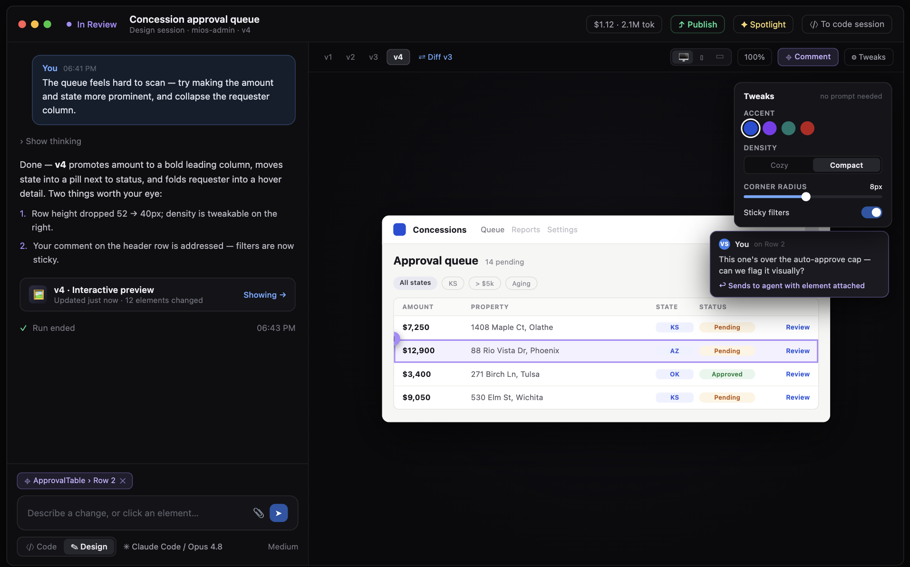

# Session Kinds: Design & App

Status: design exploration (2026-07-08). Companion to `managed-git-hosting.md` (managed
repos — app kind) and `open-design-harness-integration.md` (the prompt harness). Target
mock (depicts the focused single-artifact view; the design kind adds a canvas level above
it):

## The split

What started as one "web design session" is two products sharing one foundation, shipped
as two `SessionGroup.kind`s:

- **`design` — the artifact canvas** (Claude Design shape, Figma-like surface). Output is
  the artifact itself: screens, mockups, decks as self-contained HTML, laid out on a
  spatial canvas where the AI generates **multiple options in parallel**. You compare,
  comment, iterate, export (PDF), and hand off as *intent*. **No cloud machine, no coding
  agent** — generation is direct model calls through the `LLMAdapter`; rendering is
  sandboxed iframes in the browser.
- **`app` — the app builder** (Replit shape). Output is a running application: React
  starter on a cloud runtime, dev server + HMR, live endpoint preview, graduation to a
  code session on the same worktree.

The boundary case is deliberate: **Promote to app session** takes a chosen design artifact
and starts a linked `app` session whose first agent task is porting the mockup into the
React starter. A visible transition between kinds (links in the flat entity model), not an
invisible mid-session stack swap.

Sequencing: **design kind first** — it now needs no runtime infrastructure at all (no
machine, no bridge, no port detection), runs the harness content in its native HTML
habitat, and its canvas/comments/versions UI seeds the app kind's shell.

## The `design` kind

### No runtime — generation via LLMAdapter

A design session runs **no compute session anywhere**. The service layer calls the
`LLMAdapter` (Anthropic, etc.) directly with the composed design prompt as the `system`
param; the model streams a self-contained HTML artifact back. Consequences:

- **Zero cold start.** First tokens in ~a second; the artifact paints progressively in its
  card as it streams. No provisioning, no bridge, no daemon.
- **Fan-out is the primitive.** "Give me three directions" = three parallel streaming
  calls (same brief, direction-differentiated prompts — Open Design's direction library
  feeds exactly this). Cost is tokens only, not machine-minutes, so parallel options are
  the default UX, not a luxury.
- **No git, no managed repo.** Artifacts are entities: an `Artifact` row (id, session
  group, parent artifact, prompt/message refs, metadata) with the HTML body in object
  storage via the existing upload pipeline. Versions/variants form a **lineage DAG** via
  `parentArtifactId` — a variant fan-out is N siblings; an iteration is a child. (Managed
  git hosting remains motivated by the app kind; see `managed-git-hosting.md`.)
- **Iteration mechanics**: v1 regenerates the artifact (with prompt caching and the prior
  HTML + element context in the request); structured edit-ops are a later optimization if
  regen cost/fidelity warrants.
- Sessions/timeline still work as today — prompts, streams, and completions are session
  events; a design session is a session with no runtime attached.

### The canvas

The workspace is a pan/zoom spatial surface (Figma mental model):

- **Cards** are artifacts — each a sandboxed iframe (`srcdoc`, `sandbox`, strict CSP)
  rendering stored HTML client-side. Variants sit side-by-side; iterations stack as
  lineage (expandable history per card). Device-frame and zoom per card.
- **Selection drives the composer.** Select a card → prompts iterate on it ("darker,
  same layout"); select two → comparative prompts ("merge A's header with B's palette");
  select none → new artifacts. Element-level selection inside a card (DOM anchors — no
  build plugin needed for static HTML) attaches chips exactly as before.
- **Focus mode** = the mock's layout: one card fills the pane, version strip = its
  lineage, chat rail beside it.
- **Comments** pin to cards or elements within them (`design_comment_added` events with
  artifact id + anchor); "send to agent" queues a generation on that artifact.
- **Tweaks** stay no-model: design-kind artifacts declare tokens as CSS variables (the
  composed prompt mandates it), so the Tweaks panel patches the variable block — a
  deterministic string edit server-side, new artifact version, instant re-render.

### Exports and exits

- **PDF export**: a server-side headless Chromium worker (not per-session — a small
  render pool the server owns) loads the stored artifact and prints it; decks paginate
  correctly because the vendored deck-framework contract mandates print-ready structure.
  Output flows through the upload pipeline + `design_export_completed` event → timeline,
  shareable to channels; agents can call the same service method. v1: PDF only.
- **Publish/share**: artifacts are already stored server-side — a public artifact URL is
  a read endpoint with an access flag. Spotlight presentation mode later.
- **Promote to app session**: selected artifact(s) become the brief + visual reference of
  a linked `app` session.

Every version is trivially "live" forever — cards render stored HTML; nothing to
materialize, no machine to keep warm. Retention/GC is a row + blob policy, even simpler
than the managed-repo clock.

## The `app` kind

Unchanged from the prior spec — this is where cloud machines earn their keep:

- **Cloud-only, enforced at `startSession`** (forces `hosting: cloud`, `provisioned`
  environment, no `repoId`); the disposable machine justifies the permissive auto-run
  sandbox. Local support remains a later adapter-level project.
- **Agent-run bootstrap**: React + Vite + Tailwind + shadcn starter in the runtime image
  (`trace.tokens.json`, source-location Vite plugin, pre-warmed node_modules); agent
  scaffolds and runs it; **port auto-detection** (bridge watches listening ports,
  denylisted system ports) auto-creates and enables the `SessionEndpoint`; preview pane
  lights up.
- **Lazy managed repo** at first checkpoint; versions = `GitCheckpoint`s; HEAD live via
  dev server, older versions as captures (shared headless Chromium); restore via
  `restoreCheckpointId`.
- **Element picker** reads `data-trace-source="src/components/ApprovalTable.tsx:42"`
  stamps for component identity + file:line.
- **Tweaks** = service-layer token-file write through the bridge; HMR reflects <1s.
- **Graduation**: "To code session" in the same `SessionGroup` (shared worktree); push to
  GitHub offered, not required. **Publish v1**: endpoint `accessMode: public`.
- Harness delivery: composed prompt via `RunOptions.appendSystemPrompt` →
  `--append-system-prompt` on plain `claude_code`.

## Shared across kinds

- **Harness**: both kinds compose from the vendored Open Design stack (charter + skills +
  `DESIGN.md` design systems) — see `open-design-harness-integration.md`. Delivery
  differs: `system` param on `LLMAdapter` calls (design) vs. `--append-system-prompt`
  (app). `designSystemId` is a session-group setting; org design-system extraction stays
  the committed future direction.
- **Standalone**: neither kind attaches to an existing org repo at creation;
  prompt-first, no channel-repo inheritance.
- **Comments/Tweaks/preview chrome**: same components, same events; anchors pin to the
  version they were made on.
- **Content in one place**: skills + design systems ship as content the server (design
  kind) and runtime image (app kind) both read — same pinned tag, same formats.

## New surface area

Frontend (`apps/web/src/components/design/`):
- `DesignCanvas` (pan/zoom, artifact cards as sandboxed iframes, selection model, lineage
  expansion, focus mode), `VersionStrip`, `TweaksPanel`, `ElementChip`, comment pins
- App kind reuses the preview-pane/versions/comments chrome against endpoints instead of
  stored artifacts; chat rail reuses `SessionInput` / `SessionMessageList`

Server:
- `SessionGroup.kind` (`coding | design | app`) + `StartSessionInput.kind`
- Design kind: `Artifact` entity (lineage DAG, blob refs), generation service on
  `LLMAdapter` (streaming, parallel variants), artifact read/public endpoints,
  token-patch method (CSS-variable string edit), headless-Chromium render pool (PDF +
  card thumbnails), `design_export_completed` + `design_comment_added` events
- App kind: cloud-only enforcement, port-detection endpoint auto-registration, checkpoint
  captures, bridge token-file write, `RunOptions.appendSystemPrompt`
- Vendored Open Design composer + overlay in `packages/shared` (used by both delivery
  paths)

Runtime image (app kind only): starter kit, harness content, headless Chromium,
port detection, proxy overlay injection, iframe endpoint auth.

## Phasing

1. **Design kind core**: `kind` on SessionGroup, `Artifact` entity + generation via
   `LLMAdapter` with the vendored composer, canvas with streaming cards + fan-out
   variants, lineage/versions.
2. **Design magic**: element chips, comments, Tweaks (CSS-var patch), PDF export (render
   pool), publish/share.
3. **App kind**: cloud runtime path — starter kit, port auto-detection, endpoint iframe
   preview + auth, captures, picker Vite plugin, lazy managed repo, graduation,
   Promote-to-app from design sessions.
4. **Distribution**: real deploy (app), Spotlight mode, review statuses, PPTX/video
   exports if demanded.

(The old phase-1 "iframe preview of existing endpoints in the group view" is still a
cheap, independently useful win for coding sessions — it now rides with phase 3.)

## Open questions

1. Artifact size limits and multi-file artifacts (fonts/images) — v1 is single-file with
   inlined assets; revisit if quality demands asset pipelines.
2. Anchor durability across regenerations — the model rewrites the whole document, so
   element anchors re-resolve by stable ids the prompt mandates (`data-el` ids) rather
   than DOM paths.
3. Fan-out defaults — always offer N directions on the first brief vs. only when asked;
   cost/latency vs. wow. Likely: 3 directions on first brief, single-path after.
4. PDF fidelity — page size/margins UI; render-pool sizing and isolation on the server.
5. Whether design sessions eventually want an *optional* tool-using agent mode (e.g.
   "research competitors then design") — if so, it's an escalation to a runtime-backed
   run, not the default path.
